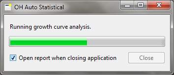

OH Auto Statistical
===================

Fully automated flood estimation for UK catchments.

Step 1
------

[Read the manual](http://docs.open-hydrology.org/projects/oh-auto-statistical), please.

Step 2
------

[Install OH Auto Statistical](https://github.com/OpenHydrology/OH-Auto-Statistical/releases/latest) (Windows, OS X and
Linux)

Step 3
------

Go!

